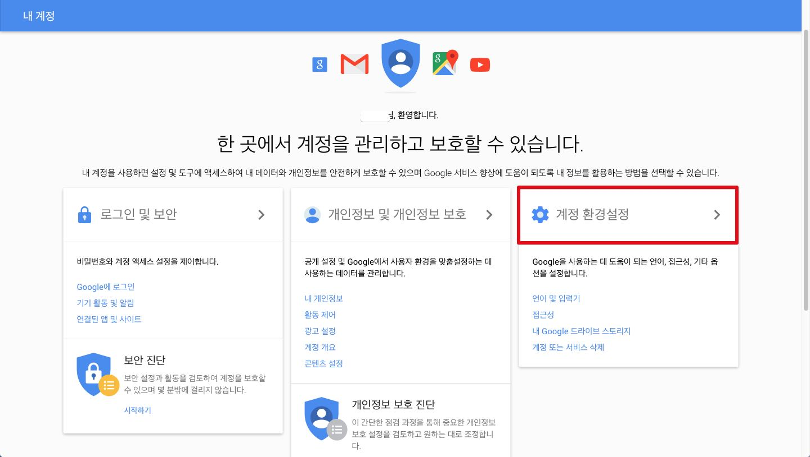
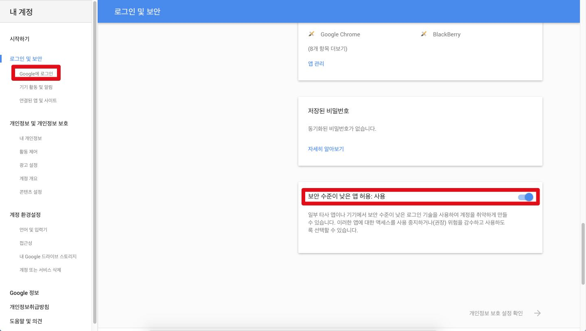

# How to reiceve gmail notification

## Google 계정 설정
 - 브라우저가 아닌 파이썬 모듈을 통해 Gmail 에서 새로운 메일이 있는지 확인하기 때문에 별도의 설정이 필요합니다.
 - 설정을 하지 않고 CheckMail.py 를 실행시킬 경우 보안 경고 메일이 올 수 있습니다.
 - 읽지 않은 메일의 수를 보고 새로운 메일이 있는지 판별합니다.
 - 모듈 실행 전 읽지 않은 메일이 있다면 모두 확인해 주시기 바랍니다.

#### 1단계. "내 계정" 에 접속 후 "계정 환경설정" 을 클릭합니다.

  > myaccount.google.com

#### 2단계. 좌측 탭의 "Google에 로그인" 선택 후 페이지 가장 아래의 "보안 수준이 낮은 앱 허용" 을 "사용" 으로 바꿔줍니다.

## CheckMail.py
 - 일정한 주기로 gmail 계정으로 접근하여 새로온 이메일이 있는지 확인하는 파이썬 모듈

> https://github.com/sw-maestro-ichai/alarm/blob/master/Rpi-Server/CheckEmail/checkMail.py
