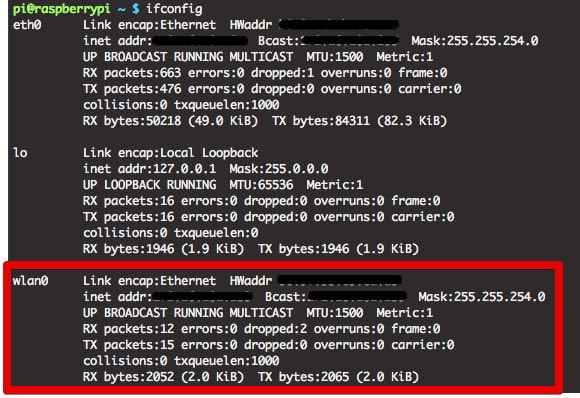
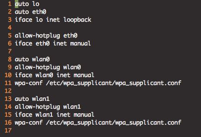
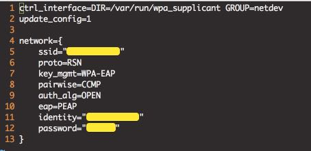

# 라즈베리파이에서 무선랜 사용하기
 - iptime n100 모델 wifi 동글을 사용합니다
 - 라즈베리파이에서 인식 가능한 wifi 모듈이라면 어떠한 것도 사용 가능합니다.

 

 ## Wifi 모듈 장착하기
 - USB형태의 wifi모듈을 usb 포트에 장착합니다.

 > lfconfig 명령어를 통해 wlan0 네트워크 디바이스 장치가 새로 인식 되었는지 확인합니다. wlan0 또는 wlan1 이 생성되었다면 정상적으로 인식 된것입니다.

 

 ## Wifi 자동연결 설정하기
 - 라즈베이 파이가 wifi에 연결된 후 이동할 시 wifi 연결이 해제질 수 있습니다.
 - wifi연결이 해제되었을 때 자동으로 접속 할 수 있도록 스크립트 파일을 작성합니다.

 - 다음과 같이 명령어를 입력합니다

 > cd /etc/ifplugd/action.d/

 > sudo mv ifupdown ifupdown.origin

 > sudo cp /etc/wpa_supplicant/ifupdown.sh ./ifupdown
 
 - 위의 명령어는 ifupdown 쉘 스크립트 파일을 바꿈으로써 wlan이 비성활화(down, 연결해제) 되었을때 다시 up(활성화) 시켜주는 동작을 수행 해주게 합니다.

 - 아래 interface 파일의 수정을 통해 유선랜, 무선랜 모두 사용 가능하게 합니다.
 > sudo vi /etc/network/interfaces

위의 명령어로 interfaces 파일을 열고 다음과 같이 수정합니다.

## Wifi 비밀번호 설정하기
- 보안이 되어있는 wifi의 경우 비밀번호를 SSID, PW를 미리 설정해 두어야 자동으로 접속이 가능합니다.
- 설정 파일은 다음위치에 있습니다

> /etc/wpa_supplicant/wpa_supplicant.conf

- 다음과 같은 형태로 SSID, identity, password 를 설정합니다.
- wifi 에 설정된 보안 방식에 따라 위의 형태를 달라질 수 있습니다.
