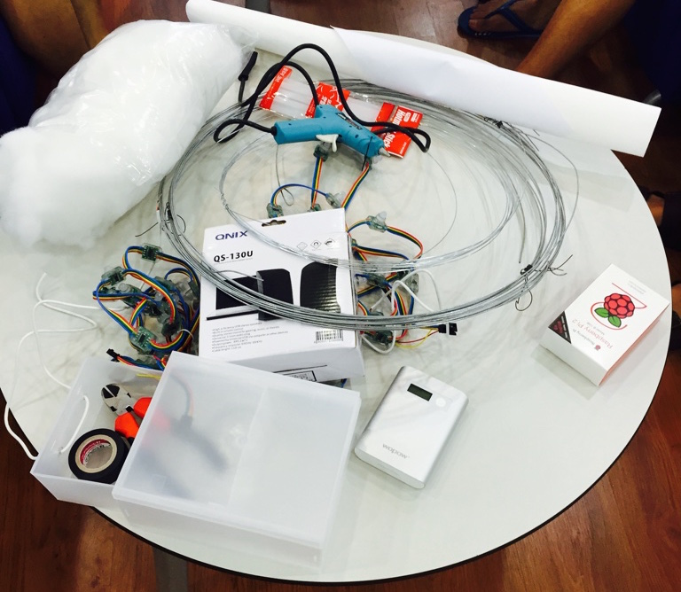
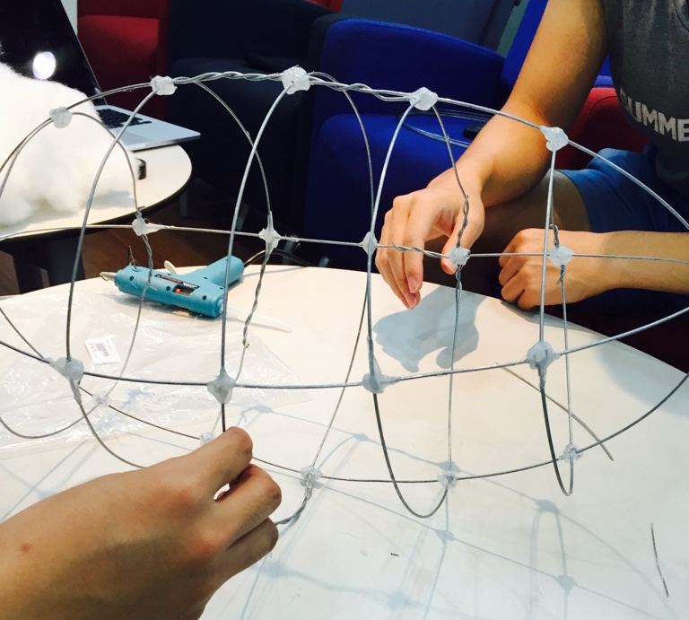
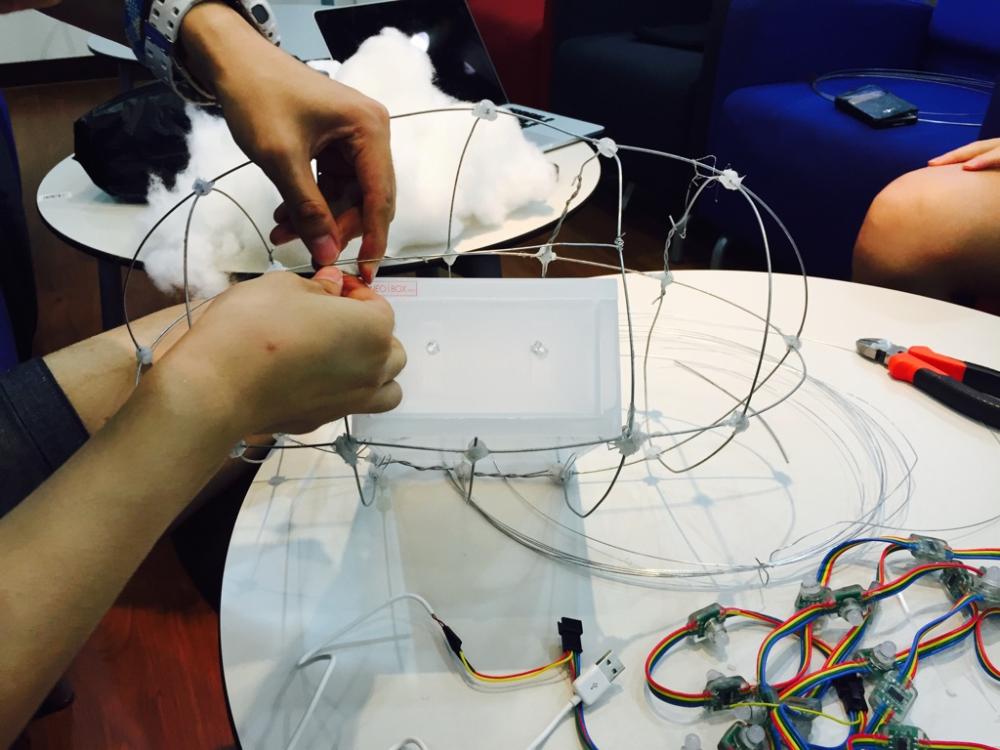
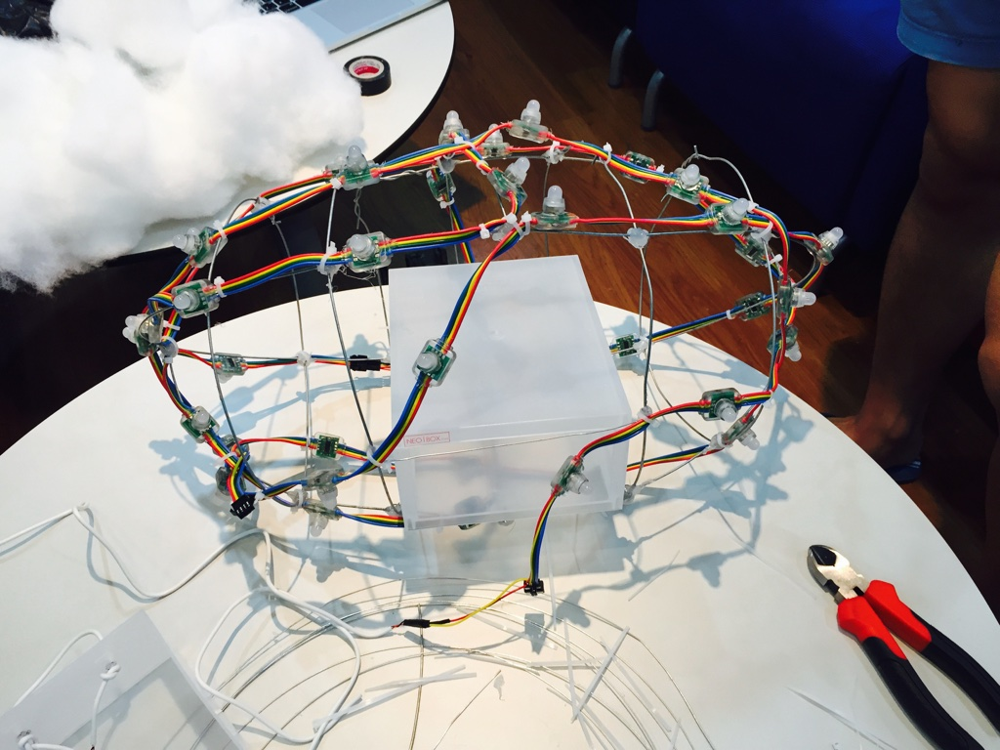
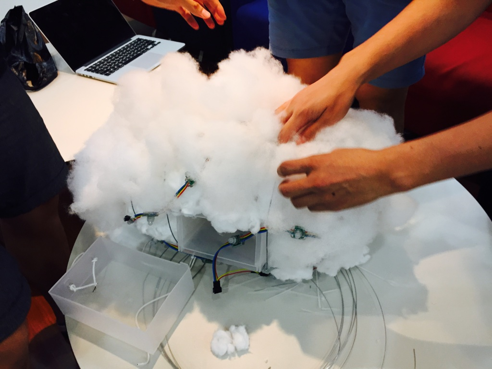
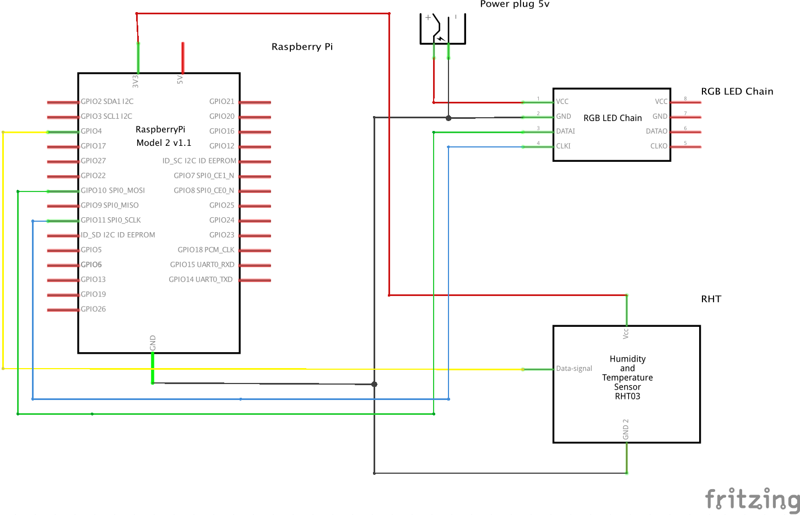

# 뭉게뭉게 (MGMG)

 - CasperJS를 이용한 서버 모니터링 모바일 앱 & 구름조명 알람
 - [제작 영상(YouTube)](https://www.youtube.com/watch?v=mQpP83Eghgk)
 - [MGMG 소개 홈페이지](http://1.234.20.120)

## 개요
 - 웹 서비스의 Health 상태를 CaperJS를 이용하여 모니터링 하고, 결과를 모바일과 Raspberry Pi 기반의 Off-Line LED 구름으로 표시 한다.
 
|  작품사진  |  프로젝트팀 ICHAI  |
| :------: | :------: | 
|  |  |

## 구름 만들기

###부품목록

|  NO  |  부품명  |  수량  | 상세 |
| :------: | ------ | --------:| :------ |
|  1  |  Raspberry Pi  |  1  |  Raspberry Pi 2  |
|  2  |  RGB LED Chain (20개 모듈 일체형)  |  2  |  12MM DIFFUSED FLAT DIGITAL RGB LED PIXELS  |
|  3  |  온습도 센서  |  1  |  RHT01  |
|  4  |  스피커  |  1  |  QS-130U  |
|  5  |  점퍼 케이블  |  3  |  테스트 소켓 점퍼 케이블 1P  | 
|  6  |  케이블타이  |  40  |  케이블타이  |
|  7  |  DC 5V 아답터  |  1  |  DC 5V 아답터  |

###제작과정

#####1. 필요한 부품들을 준비합니다.

#####2. 철사로 구름의 틀을 제작합니다.

#####3. 라즈베리파이 넣을 상자를 구름 틀 안에 넣고 고정시킵니다.

#####4. LED Chain을 케이블타이를 이용하여 구름 틀에 고정시킵니다.

#####5. 구름 틀 안과 밖에 솜을 넣어 구름 모양을 만듭니다.

#####6. 완성!

###하드웨어
#####회로도

###참고
> kocoafab, "날씨 정보를 알려 주는 구름 조명 만들기", http://kocoafab.cc/make/448, (2015.8.3)

## 메뉴얼
 1. [Raspbian OS 설치하기](https://github.com/sw-maestro-ichai/alarm/blob/master/Manual/RaspberryPi/Raspberry%20pi%20OS%20install%20:%20mac%20version.md)
 2. [WebServer 설치하기](https://github.com/sw-maestro-ichai/alarm/blob/master/Manual/RaspberryPi/install_webserver_on_raspberrypi.md)
 3. [Python 으로 LED 번개효과 만들기](https://github.com/sw-maestro-ichai/alarm/blob/master/Manual/RaspberryPi/Raspberry-WS2801-RGB-Led-Control.md)
 4. [온습도센서모듈 ( DHT11 ) 사용하기](https://github.com/sw-maestro-ichai/alarm/blob/master/Manual/RaspberryPi/How-to-Use-Temperate-Sensor.md)
 5. [서버 모니터링을 위한 CasperJS 설치](https://github.com/sw-maestro-ichai/alarm/blob/master/Manual/RaspberryPi/How%20to%20install%20casperjs%20on%20the%20raspberry%20pi.md)
 6. [라즈베리파이 무선랜 사용하기](https://github.com/sw-maestro-ichai/alarm/blob/master/Manual/RaspberryPi/How_to_use_wlan.md)
